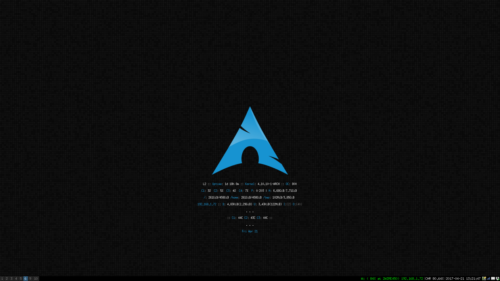
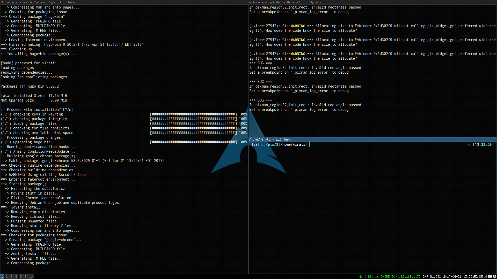

# Linux_configs
Linux Config files for non-sensitive facets

Some of my main linux config files for operation critical things. 

What I'm running on my Productivity/Light Machine

* Arch Linux
* i3 Tiling Window Manager
* Asus Laptop with SSDs only
* Conky resource monitor
* Lilyterm
* Dropbox with Github Repos

What I'm running on my Gaming/Heavy Machine

* Ubuntu 16.04
* Dual-boot Windows 10
* XFCE4 WM
* POK3R Mechanical Keyboard w/ no labels
* Logitech G300 Laser Mouse
* Wacom Drawing Tablet
